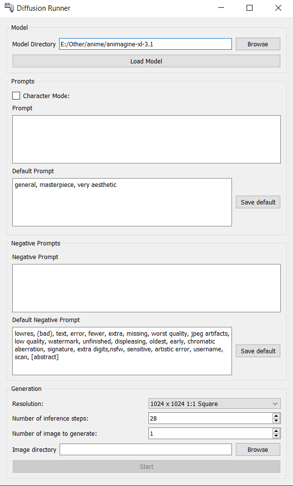

# Diffusion Runner
A simple interface to run diffuser models

- Has only been tested with animagine 3.1
- Has only been tested on Windows

## How to use:

- Install CUDA https://developer.nvidia.com/cuda-downloads
- Install torch https://pytorch.org/get-started/locally/
- Download a diffuser model locally, for exemple [animagine 3.1](https://huggingface.co/cagliostrolab/animagine-xl-3.1):
    - if going through Huggingface follow the `Clone repository` instructions
- Create virtual environment, some tutorial can be found there https://python.land/virtual-environments/virtualenv
- Activate venv and install requirements: `pip install -r requirements.txt`
- run script `py diffusion_runner.py`
- Load diffusion model
- Select the `Image directory` where to output the images
- Write prompts
- Click start

